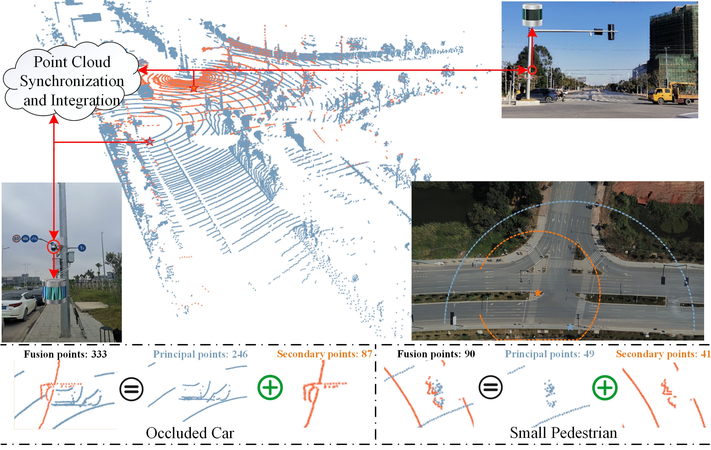
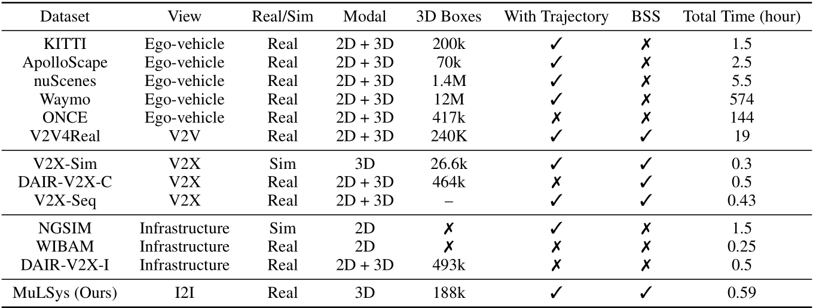

# MuLSys: A New 3D Infrastructure-side Collaborative Perception Dataset based on Multiple LiDAR System

[](https://arxiv.org/abs/2403.10145)
[](https://www.alipan.com/s/ATLDUtM3xk1) [Extraction code: 29kp]

This is the official implementation of IJCAI 2024 paper. "MuLSys: A New 3D Infrastructure-side Collaborative Perception Dataset based on Multiple LiDAR System".
[Xiaofei Zhang](https://github.com/xf-zh), [Yining Li](https://leofansq.github.io/), [Jinping Wang](https://dblp.org/pid/350/9258.html), [Xiangyi Qin](https://www.linkedin.com/in/zhenlinzhangtim/), [Ying Shen](),  [Zhengping Fan](), [Xiaojun Tan<sup>†</sup>]()

<div style="text-align:center">

</div>
<div style="text-align:center">

</div>


## Overview
- [Data Download](#data-download)
- [Data Loading](#data-loading)
- [Quick Start](#quick-start)
- [Benchmark](#benchmark)
- [Citation](#citation)
- [Acknowledgment](#acknowledgment)

## Data Download
Due to project restrictions, the MuLSys dataset is made conditionally public. If you need to use the MuLSys dataset, please fill in the following [/img/MuLSYS Dataset ReIease Agreement.docx](img/MuLSYS Dataset ReIease Agreement.docx) file and email your full name and affiliation to the contact person. We ask for your information only to ensure the dataset is used for non-commercial purposes.

After downloading the data, please put the data in the following structure:
```
├── MuLSys_detect or MuLSys_secondary or MuLSys_principal
│   ├── ImageSets
|      |── train.txt
|      |── test.txt
|      |── val.txt
│   ├── labels
|      |── 000000.txt
|      |── 000001.txt
|      |── 000002.txt
|      |── ...
│   ├── points
|      |── 000000.npy
|      |── 000001.npy
|      |── 000002.npy
|      |── ...
```

```
├── MuLSys_track
│   ├── label_02
|      |── 0000.txt
|      |── 0001.txt
|      |── 0002.txt
|      |── ...
│   ├── points
|      |── 0000
|          |── 000000.bin
|          |── 000001.bin
|          |── 000002.bin
|          |── ...
|      |── 0001
|      |── 0002
|      |── ...
│   ├── evaluate_tracking.seqmap
│   ├── evaluate_tracking.seqmap.test
│   ├── evaluate_tracking.seqmap.training
│   ├── evaluate_tracking.seqmap.val
```

## Data Loading
To facilitate researchers' use and understanding, we adapted the MuLSys dataset to the OpenPCDet framework and provided the corresponding dataset configuration file [./mulsys.config](detection_code/openpcdet/tools/cfgs/mulsys_dataset.yaml)


## Quick Start

For detection training & inference, you can find instructions in [detection_code/openpcdet](docs/corridor_scene) in detail. 

For Tracking, you can find instructions in [docs/tracking.md](docs/tracking.md) in detail.

All the checkpoints are released in link in the tabels below, you can save them in [codes/ckpts/](codes/ckpts/).

## Benchmark
### Results of 3D object detection based on the MuLSys_detect dataset

|     Methods       |Car AP@0.7 | Truck AP@0.7| Cyclist AP@0.5| Pedestrian AP@0.5| mAP40    |  FPS    |  Download Link    |
| ------------------|-----------|-------------|---------------|------------------|----------|---------|-------------------|
| Point-RCNN        |   71.75   |    94.50    |     62.91     |      68.13       |   74.32  | 4.58    |                   |
| 3DSSD             |   68.00   |    95.08    |     36.58     |      13.88       |   53.38  | 11.35   |                   |
| SECOND            |   72.82   |    95.98    |     59.91     |      47.95       |   69.17  | 20.58   |                   |
| Pointpillar       |   78.04   |    95.86    |     58.46     |      35.34       |   66.93  | 24.51   |                   |
| PV-RCNN           |   75.05   |    94.52    |     56.31     |      48.37       |   68.56  | 4.35    |                   |
| PV-RCNN++         |   80.55   |    95.92    |     70.92     |      53.31       |   75.18  | 14.66   |                   |
| CenterPoint       |   77.24   |    96.12    |     74.74     |      70.45       |   79.64  | 30.49   |                   |
| CenterPoint\_RCNN |   78.33   |    96.48    |     75.23     |      71.13       |   80.29  | 6.55    |                   |


### Results of 3D object detection based on the MuLSys_secondary, MuLSys_principal, and MuLSys_detect datasets

#### Detection result based on the Secondary LiDAR Only 


|    Methods       |Car AP@0.7 | Truck AP@0.7| Cyclist AP@0.5| Pedestrian AP@0.5|   mAP40  |  FPS    |Download Link      |
|------------------|-----------|-------------|---------------|------------------|----------|---------|-------------------|
|  Point-RCNN	     |   14.12   |    45.36    |     20.62     |      23.66       |  25.94   |  22.94  |                   |
|  Pointpillar	   |   44.77   |    82.52    |     31.42     |      33.18       |  47.97   |  87.72  |                   |
|  PV-RCNN++       |   43.49   |    76.04    |     39.94     |      34.60       |  48.52   |  16.67  |                   |
|  CenterPoint	   |   35.92   |    68.78    |     38.24     |      37.40       |  45.08   |  107.53 |                   |

#### Detection result based on the Principal LiDAR Only 

|    Methods       |Car AP@0.7 | Truck AP@0.7| Cyclist AP@0.5| Pedestrian AP@0.5|   mAP40  |  FPS    |Download Link      |
|------------------|-----------|-------------|---------------|------------------|----------|---------|-------------------|
|    Point-RCNN    | 61.14     |    48.96    |    61.99      |88.80             |   65.22  |  4.67   |                   |
|    Pointpillar   | 67.34     |    91.59    |    43.51      |23.82             |   56.57  |  25.25  |                   |
|    PV-RCNN++     | 72.59     |    91.02    |    61.21      |45.26             |   67.52  |  13.81  |                   |
|    CenterPoint   | 61.31     |    82.02    |    52.73      |49.62             |   61.42  |  33.90  |                   |

#### Detection result based on the Early Fusion	Mechanism

|    Methods       |Car AP@0.7 | Truck AP@0.7| Cyclist AP@0.5| Pedestrian AP@0.5|   mAP40  |  FPS    |Download Link      |
|------------------|-----------|-------------|---------------|------------------|----------|---------|-------------------|
|   Point-RCNN     |71.75      |94.50        |62.91          |68.13             |74.32     | 4.58    |                   |
|   Pointpillar    |78.04      |95.86        |58.46          |35.34             |66.93     |24.33    |                   |
|   PV-RCNN++      |80.55      |95.92        |70.92          |53.31             |75.18     |12.45    |                   |
|   CenterPoint    |77.24      |96.12        |74.74          |70.45             |79.64     |30.49    |                   |

#### Detection result based on the Late Fusion	Mechanism

|    Methods       |Car AP@0.7 | Truck AP@0.7| Cyclist AP@0.5| Pedestrian AP@0.5|   mAP40  |  FPS    |Download Link      |
|------------------|-----------|-------------|---------------|------------------|----------|---------|-------------------|
|Point-RCNN        |62.69      |90.93        |52.31          |61.31             |66.81     |1.32     |                   |
|Pointpillar       |68.65      |93.48        |49.92          |31.81             |60.96     |1.81     |                   |
|PV-RCNN++         |68.01      |92.65        |56.95          |53.47             |67.77     |1.21     |                   |
|CenterPoint       |58.13      |85.65        |56.01          |50.03             |62.45     |6.40     |                   |

#### Detection result based on the Middle Fusion	Mechanism

|    Methods       |Car AP@0.7 | Truck AP@0.7| Cyclist AP@0.5| Pedestrian AP@0.5|   mAP40  |  FPS    |Download Link      |
|------------------|-----------|-------------|---------------|------------------|----------|---------|-------------------|
|Point-RCNN        |    -      |    -        |    -          |    -             |    -     |    -    |                   |
|Pointpillar       |    -      |    -        |    -          |    -             |    -     |    -    |                   |
|PV-RCNN++         |73.78      |91.89        |62.06          |52.06             |69.95     |13.02    |                   |
|CenterPoint       |52.74      |81.73        |51.19          |38.95             |56.15     |15.85    |                   |

### Results of data domain transfer on the car class

 &nbsp; &nbsp; &nbsp; &nbsp; &nbsp; &nbsp; &nbsp; &nbsp; &nbsp; &nbsp; &nbsp; &nbsp; &nbsp; &nbsp; &nbsp; &nbsp; |   &nbsp; &nbsp; &nbsp; MuLSys→KITTI &nbsp; &nbsp; &nbsp; &nbsp;| &nbsp; &nbsp; &nbsp;DAIR-V2X-I→KITTI &nbsp; &nbsp;| &nbsp;  &nbsp; &nbsp;  &nbsp;   &nbsp; ONCE→KITTI    &nbsp;  &nbsp; &nbsp;  &nbsp;    | &nbsp; MuLSys→DAIR-V2X-I &nbsp; | DAIR-V2X-I→MuLSys|

| Source→Target  |Moderate | mAP40 |Moderate| mAP40|   Moderate |  mAP40  |Moderate  |mAP40| AP40 |
| ---------------|---------|-------|--------|------|------------|---------|----------|-----|------|
| Source Domain  | 49.45   | 52.97 |36.47   | 37.98|  38.65     |   41.65 |  29.54   |31.05| 32.16|
|     SN         | 58.66   | 61.87 |44.76   | 44.80|  45.95     |   49.34 |  30.47   |31.81| 33.25|
|     ST3D       | 70.06   | 74.63 |62.04   | 65.35|  53.92     |   58.19 |  34.65   |48.98| 37.03|
| Target Domain  | 78.63   | 81.63 |78.63   | 81.63|  78.63     |   81.63 |  78.51   |81.41| 71.75|

## Citation
If you find MuLSys useful in your research or applications, please consider giving us a star 🌟 and citing it by the following BibTeX entry.
```shell
@inproceedings{zhang2024mulsys,
  title={MuLSys: A New 3D Infrastructure-side Collaborative Perception Dataset based on Multiple LiDAR System},
  author={Zhang, Xiaofei and Li, Yining and Wang, Jinping and Qin, Xiangyi and Shen, Ying and Fan, Zhengping and Tan, Xiaojun},
  booktitle={Proceedings of the International Joint Conference on Artificial Intelligence (IJCAI)},
  year={2024}
}
```

## Acknowledgment
- [DAIR-V2X](https://github.com/AIR-THU/DAIR-V2X)
- [AB3DMOT](https://github.com/xinshuoweng/AB3DMOT)
- [PC3T](https://github.com/hailanyi/3D-Multi-Object-Tracker)
- [ST3D](https://github.com/CVMI-Lab/ST3D)
