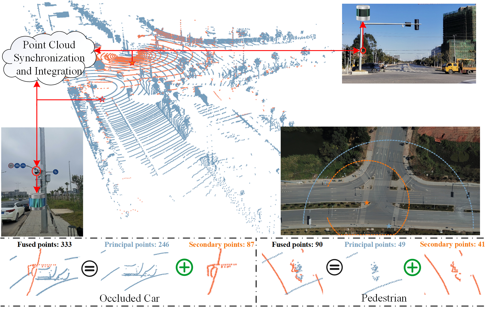

# InScope: A New Real-world 3D Infrastructure-side Collaborative Perception Dataset for Open Traffic Scenarios


This is the official implementation of InScope dataset. "InScope: A New Real-world 3D Infrastructure-side Collaborative Perception Dataset for Open Traffic Scenarios".
[Xiaofei Zhang](https://github.com/xf-zh), [Yining Li](https://github.com/liyn69), [Jinping Wang](https://github.com/Cimy-wang), [Xiangyi Qin](https://github.com/fang196), [Ying Shen](),  [Zhengping Fan](), [Xiaojun Tan<sup>†</sup>]()

<div style="text-align:center">

</div>
<div style="text-align:center">

</div>
<div style="text-align:center">

</div>

## Overview
- [Data Download](#data-download)
- [Data Loading](#data-loading)
- [Quick Start](#quick-start)
- [Benchmark](#benchmark)
- [TODO](#todo)
- [Citation](#citation)
- [Acknowledgment](#acknowledgment)

## Data Download
Due to project restrictions, the InScope dataset is made conditionally public. If you need to use the InScope dataset, please fill in the following [./assets/InScope_Dataset_Release_Agreement.docx](assets/InScope_Dataset_ReIease_Agreement.docx) file and email your full name and affiliation to the contact person. We ask for your information only to ensure the dataset is used for non-commercial purposes.

After downloading the data, please put the data in the following structure:
```
├── InScope-Sec, InScope_Pri, and InScope datasets
│   ├── ImageSets
|      |── train.txt
|      |── test.txt
|      |── val.txt
│   ├── labels
|      |── 000000.txt
|      |── 000001.txt
|      |── 000002.txt
|      |── ...
│   ├── points
|      |── 000000.npy
|      |── 000001.npy
|      |── 000002.npy
|      |── ...
```

```
├── InScope_track
│   ├── label_02
|      |── 0000.txt
|      |── 0001.txt
|      |── 0002.txt
|      |── ...
│   ├── points
|      |── 0000
|          |── 000000.bin
|          |── 000001.bin
|          |── 000002.bin
|          |── ...
|      |── 0001
|      |── 0002
|      |── ...
│   ├── evaluate_tracking.seqmap
│   ├── evaluate_tracking.seqmap.test
│   ├── evaluate_tracking.seqmap.training
│   ├── evaluate_tracking.seqmap.val
```

## Data Loading
To facilitate researchers' use and understanding, we adapted the InScope dataset to the OpenPCDet framework and provided the corresponding dataset configuration file [./InScope.config](detection_code/openpcdet/tools/cfgs/dataset_configs/inscope_dataset.yaml)


## Quick Start

For detection training & inference, you can find instructions in [detection_code/openpcdet/README_InScope.md](/detection_code/openpcdet/README_InScope.md) in detail. 

All the checkpoints are released in link in the tabels below, you can save them in [codes/ckpts/](codes/ckpts/).

## Benchmark
### Results of 3D object detection based on the InScope dataset

|     Methods       |Car AP@0.7 | Pedestrian AP@0.5| Cyclist AP@0.5| Truck AP@0.7| mAP40    |  FPS    |  Download Link    |
| ------------------|-----------|------------------|---------------|-------------|----------|---------|-------------------|
| PointRCNN         |   71.75   |      68.13       |     62.91     |    94.50    |   74.32  | 4.58    |[[URL](https://drive.google.com/file/d/1ao6LSOUUzU8INEt3bL9dmZQf6XWM9oiT/view?usp=drive_link)]|
| 3DSSD             |   68.00   |      13.88       |     36.58     |    95.08    |   53.38  | 11.35   |[[URL](https://drive.google.com/file/d/1qKO2OvIYoyQutvOyladgDBocrydLJlhJ/view?usp=drive_link)]|
| SECOND            |   72.82   |      47.95       |     59.91     |    95.98    |   69.17  | 20.58   |[[URL](https://drive.google.com/file/d/1Qm9rH5cdyx6QgR2TKxySuzc89GQ_k0UR/view?usp=drive_link)]|
| Pointpillar       |   78.04   |      35.34       |     58.46     |    95.86    |   66.93  | 24.51   |[[URL](https://drive.google.com/file/d/12SUPpVetcvVwMXfwIkzfI5eeVniFrNJV/view?usp=drive_link)]|
| PV-RCNN           |   75.05   |      48.37       |     56.31     |    94.52    |   68.56  | 4.35    |[[URL](https://drive.google.com/file/d/17XxYOog4pmJGPkNARN5HvLyc218_EpAL/view?usp=drive_link)]|
| PV-RCNN++         |   80.55   |      53.31       |     70.92     |    95.92    |   75.18  | 14.66   |[[URL](https://drive.google.com/file/d/1jotkmYuJyKD6Q3YS7xL7lTH-5KngwNR_/view?usp=drive_link)]|
| CenterPoint       |   77.24   |      70.45       |     74.74     |    96.12    |   79.64  | 30.49   |[[URL](https://drive.google.com/file/d/1WRsrugwZ9UqIlIlCRfbAmXJ5OfRCxVdN/view?usp=drive_link)]|
| CenterPoint\_RCNN |   78.33   |      71.13       |     75.23     |    96.48    |   80.29  | 6.55    |[[URL](https://drive.google.com/file/d/1ESoJaIpPfmYpVEk4c17rD6S-hq1bglQZ/view?usp=drive_link)]|


### Results of 3D object detection based on the InScope-Sec, InScope_Pri, and InScope datasets

#### Detection result based on the InScope-Sec Only 


|    Methods       |Car AP@0.7 | Pedestrian AP@0.5| Cyclist AP@0.5| Truck AP@0.7|   mAP40  |  FPS    |Download Link      |
|------------------|-----------|------------------|---------------|-------------|----------|---------|-------------------|
|  PointRCNN	     |   14.12   |      23.66       |     20.62     |    45.36    |  25.94   |  22.94  |[[URL](https://drive.google.com/file/d/1jN_uRx3T4A49yvzx-0uwmEamoTzSGpKe/view?usp=drive_link)]|
|  Pointpillar	   |   44.77   |      33.18       |     31.42     |    82.52    |  47.97   |  87.72  |[[URL](https://drive.google.com/file/d/15YCTdsmDcsZETymaHETviNurq5Pacigo/view?usp=drive_link)]|
|  PV-RCNN++       |   43.49   |      34.60       |     39.94     |    76.04    |  48.52   |  16.67  |[[URL](https://drive.google.com/file/d/1pBbnGDaM-AEFy_dtd84h21E4ZEyZ4P6c/view?usp=drive_link)]|
|  CenterPoint	   |   35.92   |      37.40       |     38.24     |    68.78    |  45.08   |  107.53 |[[URL](https://drive.google.com/file/d/1mJ5HQzk2fjj2pIeBqMuTUT7pz3Bc7dXM/view?usp=drive_link)]|

#### Detection result based on the InScope_Pri Only 

|    Methods       |Car AP@0.7 | Pedestrian AP@0.5| Cyclist AP@0.5| Truck AP@0.7|   mAP40  |  FPS    |Download Link      |
|------------------|-----------|------------------|---------------|-------------|----------|---------|-------------------|
|    PointRCNN     | 61.14     |88.80             |    61.99      |    48.96    |   65.22  |  4.67   |[[URL](https://drive.google.com/file/d/1jN_uRx3T4A49yvzx-0uwmEamoTzSGpKe/view?usp=drive_link)]|
|    Pointpillar   | 67.34     |23.82             |    43.51      |    91.59    |   56.57  |  25.25  |[[URL](https://drive.google.com/file/d/15YCTdsmDcsZETymaHETviNurq5Pacigo/view?usp=drive_link)]|
|    PV-RCNN++     | 72.59     |45.26             |    61.21      |    91.02    |   67.52  |  13.81  |[[URL](https://drive.google.com/file/d/1pBbnGDaM-AEFy_dtd84h21E4ZEyZ4P6c/view?usp=drive_link)]|
|    CenterPoint   | 61.31     |49.62             |    52.73      |    82.02    |   61.42  |  33.90  |[[URL](https://drive.google.com/file/d/1mJ5HQzk2fjj2pIeBqMuTUT7pz3Bc7dXM/view?usp=drive_link)]|

#### Detection result based on the Early Fusion (InScope) Mechanism

|    Methods       |Car AP@0.7 | Pedestrian AP@0.5| Cyclist AP@0.5| Truck AP@0.7|   mAP40  |  FPS    |Download Link      |
|------------------|-----------|------------------|---------------|-------------|----------|---------|-------------------|
|   PointRCNN      |71.75      |68.13             |62.91          |94.50        |74.32     | 4.58    |[[URL](https://drive.google.com/file/d/1ao6LSOUUzU8INEt3bL9dmZQf6XWM9oiT/view?usp=drive_link)]|
|   Pointpillar    |78.04      |35.34             |58.46          |95.86        |66.93     |24.33    |[[URL](https://drive.google.com/file/d/12SUPpVetcvVwMXfwIkzfI5eeVniFrNJV/view?usp=drive_link)]|
|   PV-RCNN++      |80.55      |53.31             |70.92          |95.92        |75.18     |12.45    |[[URL](https://drive.google.com/file/d/1jotkmYuJyKD6Q3YS7xL7lTH-5KngwNR_/view?usp=drive_link)]|
|   CenterPoint    |77.24      |70.45             |74.74          |96.12        |79.64     |30.49    |[[URL](https://drive.google.com/file/d/1WRsrugwZ9UqIlIlCRfbAmXJ5OfRCxVdN/view?usp=drive_link)]|

#### Detection result based on the Late Fusion Mechanism

|    Methods       |Car AP@0.7 | Pedestrian AP@0.5| Cyclist AP@0.5| Truck AP@0.7|   mAP40  |  FPS    |Download Link      |
|------------------|-----------|------------------|---------------|-------------|----------|---------|-------------------|
|PointRCNN         |62.69      |61.31             |52.31          |90.93        |66.81     |1.32     |[[URL](https://drive.google.com/file/d/1jN_uRx3T4A49yvzx-0uwmEamoTzSGpKe/view?usp=drive_link)]+[[URL](https://drive.google.com/file/d/1jN_uRx3T4A49yvzx-0uwmEamoTzSGpKe/view?usp=drive_link)]|
|Pointpillar       |68.65      |31.81             |49.92          |93.48        |60.96     |1.81     |[[URL](https://drive.google.com/file/d/15YCTdsmDcsZETymaHETviNurq5Pacigo/view?usp=drive_link)]+[[URL](https://drive.google.com/file/d/15YCTdsmDcsZETymaHETviNurq5Pacigo/view?usp=drive_link)]|
|PV-RCNN++         |68.01      |53.47             |56.95          |92.65        |67.77     |1.21     |[[URL](https://drive.google.com/file/d/1pBbnGDaM-AEFy_dtd84h21E4ZEyZ4P6c/view?usp=drive_link)]+[[URL](https://drive.google.com/file/d/1pBbnGDaM-AEFy_dtd84h21E4ZEyZ4P6c/view?usp=drive_link)]|
|CenterPoint       |58.13      |50.03             |56.01          |85.65        |62.45     |6.40     |[[URL](https://drive.google.com/file/d/1mJ5HQzk2fjj2pIeBqMuTUT7pz3Bc7dXM/view?usp=drive_link)]+[[URL](https://drive.google.com/file/d/1mJ5HQzk2fjj2pIeBqMuTUT7pz3Bc7dXM/view?usp=drive_link)]|

#### Detection result based on the Middle Fusion Mechanism

|    Methods       |Car AP@0.7 | Pedestrian AP@0.5| Cyclist AP@0.5| Truck AP@0.7|   mAP40  |  FPS    |Download Link      |
|------------------|-----------|------------------|---------------|-------------|----------|---------|-------------------|
|Point-RCNN        |    -      |    -             |    -          |    -        |    -     |    -    |                   |
|Pointpillar       |    -      |    -             |    -          |    -        |    -     |    -    |                   |
|PV-RCNN++         |73.78      |52.06             |62.06          |91.89        |69.95     |13.02    |[[URL](https://drive.google.com/file/d/14MVUUhwrkQsRm7Fq1FBkFKy1DpF4dhpO/view?usp=drive_link)]|
|CenterPoint       |52.74      |38.95             |51.19          |81.73        |56.15     |15.85    |[[URL](https://drive.google.com/file/d/19f6ANkk4Uj3ngOF5TIOluyInwSj0Mb-4/view?usp=drive_link)]|

### Results of data domain transfer on the car class


| Source→Target  | DAIR-V2X-I→KITTI|ONCE→KITTI|InScope→KITTI|InScope→DAIR-V2X-I|DAIR-V2X-I→InScope|
| ---------------|-----------------|----------|-------------|------------------|------------------|
|                |      mAP40      |   mAP40  |     mAP40   |      mAP40       |       AP40       |
| Source Domain  |37.98[[URL](https://drive.google.com/file/d/1zLcH9z23xV9L-u5o-rlD6PSJ3pDwSaCU/view?usp=drive_link)]|41.65[[URL](https://drive.google.com/file/d/1iv5CHaX6vnwx290RZabsK3xRMm7nKKtW/view?usp=drive_link)]|52.97[[URL](https://drive.google.com/file/d/1bcb-9TaW6cngE3pNVaY1eOr3bxsXC4w_/view?usp=drive_link)]|31.05[[URL](https://drive.google.com/file/d/1bcb-9TaW6cngE3pNVaY1eOr3bxsXC4w_/view?usp=drive_link)]|32.16[[URL](https://drive.google.com/file/d/1zLcH9z23xV9L-u5o-rlD6PSJ3pDwSaCU/view?usp=drive_link)]|
|     SN         |44.80[[URL](https://drive.google.com/file/d/1R-POhg-tkALJIzg_nX0IwiCEiyRXw0JV/view?usp=drive_link)]|49.34[[URL](https://drive.google.com/file/d/1ktSXk494e3ABRGgu-LSRqmZWuN5phxcL/view?usp=drive_link)] |61.87[[URL](https://drive.google.com/file/d/1sFFhde7Wx9MjQmTAsCLCAWzcL3z7aZaV/view?usp=drive_link)]|31.81[[URL](https://drive.google.com/file/d/1FQasZOoDm4-N4fhPPc60EkLypMyAPX-8/view?usp=drive_link)]|33.25[[URL](https://drive.google.com/file/d/1J0dgsRWNwA8V2amAGi8jP6paDDliQ8I-/view?usp=drive_link)]| 
|     ST3D       |      65.35[[URL](https://drive.google.com/file/d/14VkXIr-Xw1YmNs_WkPdfjKnl-5wB3Egg/view?usp=drive_link)]      |    58.19[[URL](https://drive.google.com/file/d/1ZI1RFNggnM04uvL2fXv7vQvTYxHsUw9-/view?usp=drive_link)] |     74.63[[URL](https://drive.google.com/file/d/1y35PGDbFZNBsi47TCXP_qTW15FTJZ3-0/view?usp=drive_link)]   |      48.98[[URL](https://drive.google.com/file/d/1Qbx-wH7QB8B_-jksE3zJzrn_cgObvzYC/view?usp=drive_link)]       |       37.03[[URL](https://drive.google.com/file/d/1SjzGBPucVIuxm39fG3ooFAGxKqCtTqY5/view?usp=drive_link)]      |
| Target Domain  |81.63[[URL](https://drive.google.com/file/d/14VkXIr-Xw1YmNs_WkPdfjKnl-5wB3Egg/view?usp=drive_link)]|81.63[[URL](https://drive.google.com/file/d/1ZI1RFNggnM04uvL2fXv7vQvTYxHsUw9-/view?usp=drive_link)]|81.63[[URL](https://drive.google.com/file/d/1y35PGDbFZNBsi47TCXP_qTW15FTJZ3-0/view?usp=drive_link)]|81.41[[URL](https://drive.google.com/file/d/1Qbx-wH7QB8B_-jksE3zJzrn_cgObvzYC/view?usp=drive_link)]|71.75[[URL](https://drive.google.com/file/d/1SjzGBPucVIuxm39fG3ooFAGxKqCtTqY5/view?usp=drive_link)]|

### 3D Multiobject tracking results on the car, pedestrian, cyclist, and truck.

#### Tracking result of the AD3DMOT on the car class (IoU threshold = 0.5/0.7)

|Detector   |sAMOTA↑    |MOTA       |IDSW↓ |FRAG↓  |
|-----------|-----------|-----------|------|-------|
|PointRCNN  |60.97/50.27|41.56/33.77|10/13 |99/272 |
|Pointpillar|49.96/33.75|33.82/22.33|3/13  |64/379 |
|PVRCNN++   |63.00/52.65|43.22/34.12|126/82|177/349|
|Centerpoint|68.78/57.50|45.42/37.58|6/16  |70/267 |

#### Tracking result of the AD3DMOT on the pedestrian class (IoU threshold = 0.25/0.5)

|Detector   |  sAMOTA↑  |   MOTA↑   |IDSW↓|FRAG↓|
|-----------|-----------|-----------|------|----|
|PointRCNN  |82.53/78.67|73.34/68.20|3/2|124/181|
|Pointpillar|82.18/76.79|75.26/70.33|9/8|80/182 |
|PVRCNN++   |81.50/77.20|69.15/64.53|9/8|76/141 |
|Centerpoint|81.44/76.11|71.89/65.85|7/7|70/207 |

#### Tracking result of the AD3DMOT on the cyclist class (IoU threshold = 0.25/0.5)

|Detector   |sAMOTA↑    |MOTA↑      |IDSW↓|  FRAG↓ |
|-----------|-----------|-----------|-----|--------|
|PointRCNN  |74.81/60.34|63.25/44.45|12/6 |595/1834|
|Pointpillar|82.23/64.98|68.85/46.82|56/44|391/2166|
|PVRCNN++   |81.63/68.71|67.56/50.72|83/39|386/1560|
|Centerpoint|78.76/61.25|61.02/40.98|27/15|367/1720|

#### Tracking result of the AD3DMOT on the truck class (IoU threshold = 0.5/0.7)

|Detector   |sAMOTA↑    |   MOTA↑   |IDSW↓|FRAG↓|
|-----------|-----------|-----------|-----|-----|
|PointRCNN  |59.89/56.59|39.73/37.06|1/1  |6/22 |
|Pointpillar|32.09/27.42|27.79/25.36|0/0  |4/24 |
|PVRCNN++   |31.39/28.54|27.71/25.75|3/3  |10/20|
|Centerpoint|67.38/62.03|63.48/59.30|5/4  |8/35 |

## TODO

```
The code and configuration of 3DMOT on the InScope dataset will be released.
```

## Citation
If you find InScope useful in your research or applications, please consider giving us a star 🌟.


## Acknowledgment
- [DAIR-V2X](https://github.com/AIR-THU/DAIR-V2X)
- [AB3DMOT](https://github.com/xinshuoweng/AB3DMOT)
- [ST3D](https://github.com/CVMI-Lab/ST3D)
